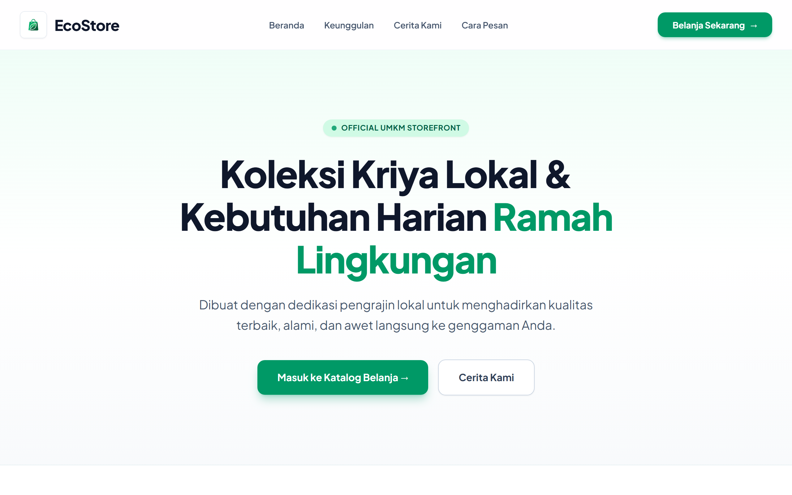
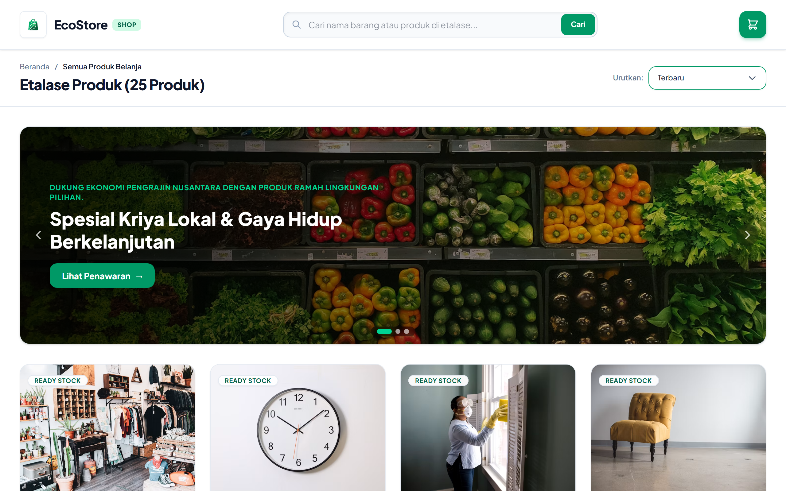
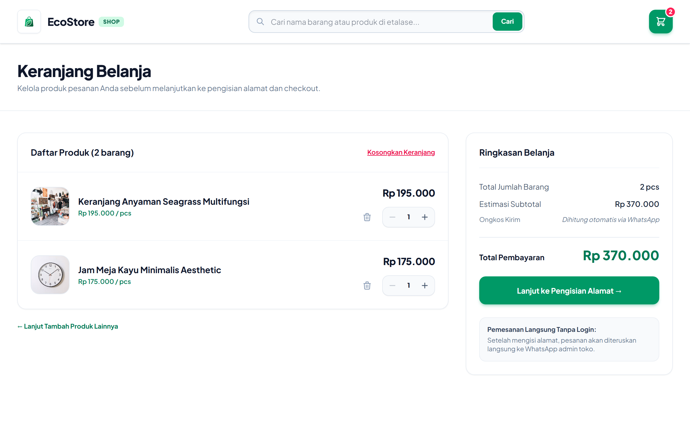
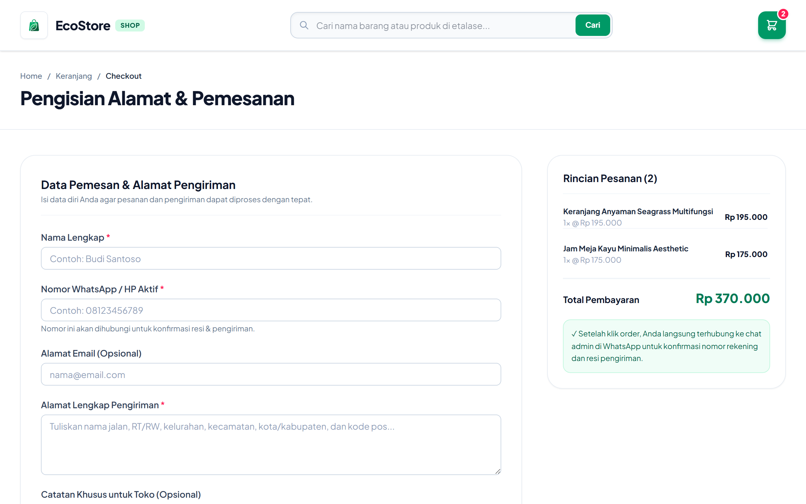
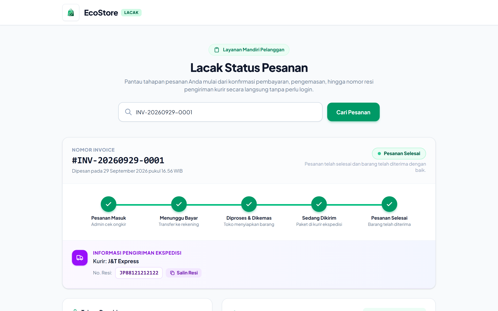
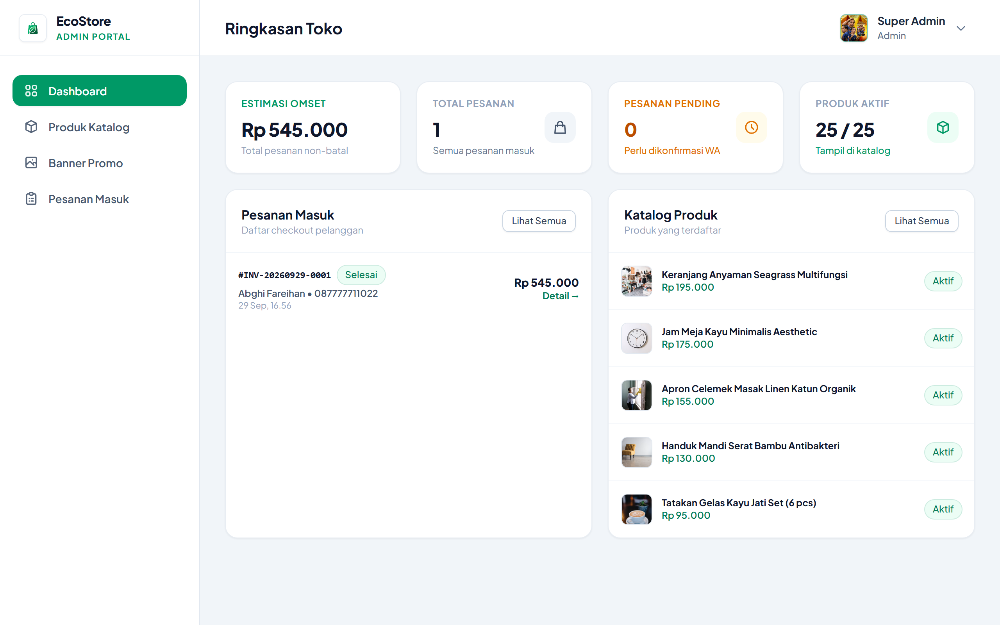
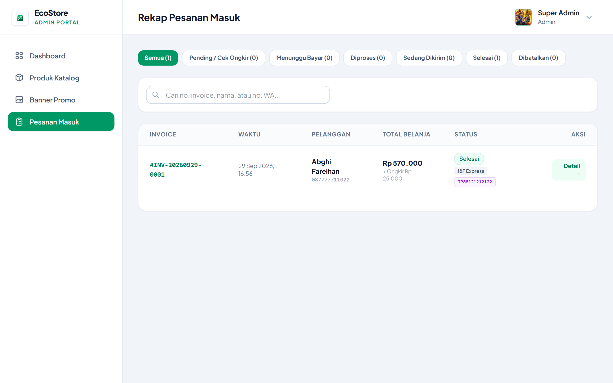
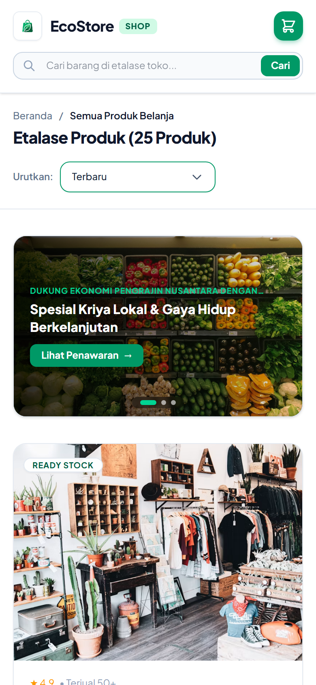
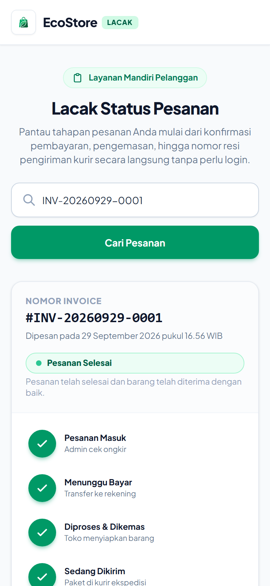

# EcoStore — Platform E-Commerce & Kriya Ramah Lingkungan 🌿

<p align="center">
  
</p>

<p align="center">
  
  
  
  
  
</p>

---

## 📌 Tentang Project

**EcoStore** adalah aplikasi web e-commerce *modern*, *clean*, dan *mobile-first* yang dirancang khusus untuk memfasilitasi operasional toko UMKM (kriya, kerajinan lokal, dan produk ramah lingkungan).

Sistem ini menjembatani kemudahan belanja online tanpa kerumitan registrasi akun (*guest order*), terintegrasi langsung dengan pemesanan via WhatsApp, serta dilengkapi **Portal Lacak Pesanan Mandiri** dan **Panel Administrasi Toko** yang komprehensif.

---

## 📸 Preview Tampilan Antarmuka (UI Showcase)

### 1. Etalase Produk & Promo Banner
Menampilkan katalog produk dengan pencarian instan, filter sortir harga, banner promosi carousel interaktif, dan notifikasi keranjang cerdas.

<p align="center">
  
</p>

---

### 2. Keranjang Belanja & Checkout WhatsApp
Perhitungan subtotal belanja otomatis dengan form pengisian alamat pengiriman yang terintegrasi langsung ke chat WhatsApp Admin.

<p align="center">
  
  
</p>

---

### 3. Portal Lacak Status Pesanan (Guest Tracking)
Pelanggan dapat melacak status pesanan secara mandiri tanpa login melalui nomor invoice atau nomor WhatsApp, melihat 5 tahapan progres, menyalin resi kurir, serta mengunduh dokumen Invoice PDF resmi.

<p align="center">
  
</p>

---

### 4. Dashboard & Rekap Pesanan Admin
Panel manajemen back-office untuk memantau ringkasan estimasi omset, mengelola antrean pesanan masuk, menginput ongkos kirim, kurir ekspedisi, serta nomor resi pengiriman.

<p align="center">
  
  
</p>

---

### 5. Pengalaman Mobile-First Responsif
Dirancang dengan presisi untuk kenyamanan pengguna perangkat smartphone: tata letak proporsional, touch-swipe gestures, tombol aksi anti-terpotong, dan navigasi yang intuitif.

<p align="center">
  
  
</p>

---

## ✨ Fitur-Fitur Utama

### 🛍️ Sisi Pembeli (Storefront)
* **Landing Page Interaktif:** Hero section informatif, nilai keunggulan produk ramah lingkungan, dan cerita UMKM.
* **Etalase & Katalog Produk:** Pencarian instan real-time, filter sortir produk (terbaru, harga tertinggi/terendah), dan label status stok.
* **Banner Promo Carousel Dinamis:** Banner promosi dengan autoplay, indikator dots, dan dukungan gesture sentuh (*touch swipe* di mobile).
* **Keranjang Belanja Cepat:** Tambah barang, ubah kuantitas produk, dan toast notifikasi floating yang rapi di tengah layar.
* **Checkout Terkoneksi WhatsApp:** Pembeli langsung diarahkan ke chat WhatsApp resmi toko dengan format draf pesanan otomatis.
* **Portal Lacak Pesanan Mandiri:**
  * Memantau 5 tahapan: *Pesanan Masuk* &rarr; *Menunggu Pembayaran* &rarr; *Diproses & Dikemas* &rarr; *Sedang Dikirim* &rarr; *Pesanan Selesai*.
  * Informasi rekening transfer toko dengan tombol salin otomatis.
  * Nomor resi pengiriman kurir ekspedisi dengan fitur *Salin Resi*.
  * Unduh dokumen resmi **Invoice Pembelian (Format PDF)**.

### 🛡️ Sisi Admin (Back-Office)
* **Dashboard Statistik Real-Time:** Ringkasan estimasi omset, total pesanan masuk, antrean pesanan pending, dan jumlah produk aktif.
* **Manajemen Pesanan Bertahap:**
  * Status awal `pending` (menunggu admin mengecek ongkos kirim ke alamat pembeli).
  * Input ongkos kirim dan rekening toko untuk menerbitkan status `payment_pending`.
  * Verifikasi pembayaran untuk memproses barang (`processing`).
  * Input nama kurir ekspedisi (JNE, J&T, SiCepat, dll.) dan nomor resi untuk update ke `shipped`.
  * Penyelesaian pesanan (`completed`) atau pembatalan (`cancelled`).
* **Katalog Produk:** Tambah, edit, unggah foto produk, atur deskripsi, harga, dan status aktif/non-aktif.
* **Kelola Banner Promo:** Unggah gambar banner promo, atur judul penawaran, subtitle, dan tautan promo.
* **Pengaturan Toko Terpadu:** Pengaturan nama brand, slogan, nomor WhatsApp admin, alamat fisik toko, rekening bank tujuan transfer, dan upload logo toko dengan live preview.

---

## 🛠️ Arsitektur & Teknologi

* **Backend Framework:** Laravel 12
* **Frontend Framework:** Vue 3 (Composition API, `<script setup>`)
* **SPA Bridge:** Inertia.js v2
* **CSS Framework:** Tailwind CSS v4
* **Database:** MySQL / SQLite
* **PDF Generator:** Barryvdh DomPDF

---

## 🚀 Panduan Instalasi Lokal

Ikuti langkah-langkah berikut untuk menjalankan project di komputer lokal:

### 1. Clone Repositori
```bash
git clone https://github.com/abghifareihand/ecommerce-web.git
cd ecommerce-web
```

### 2. Instalasi Dependensi
```bash
# Instal dependensi PHP (Composer)
composer install

# Instal dependensi JavaScript (NPM)
npm install
```

### 3. Konfigurasi Environment
```bash
cp .env.example .env
php artisan key:generate
```
*Pastikan konfigurasi koneksi database di file `.env` sudah disesuaikan.*

### 4. Migrasi & Seeder Database
```bash
php artisan migrate --seed
php artisan storage:link
```

### 5. Kompilasi Aset Frontend
```bash
npm run build
```

### 6. Jalankan Server Lokal
```bash
# Terminal 1: Backend Server
php artisan serve

# Terminal 2: Frontend Dev Server (Opsional untuk development)
npm run dev
```

Buka browser Anda di `http://localhost:8000`.

---

## 🔑 Akun Default (Pengujian)

| Role | Email | Password | Akses URL |
| :--- | :--- | :--- | :--- |
| **Super Admin** | `admin@example.com` | `password` | `http://localhost:8000/admin/login` |
| **Pelanggan (Guest)** | *Tanpa Login* | *Tanpa Login* | `http://localhost:8000/products` |
| **Lacak Pesanan** | *Invoice: `INV-20260929-0001`* | - | `http://localhost:8000/orders/track` |

---

## 📄 Lisensi

Project ini dilisensikan di bawah lisensi open-source [MIT License](LICENSE).
